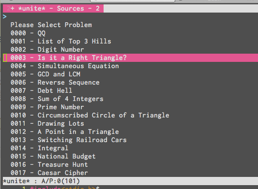
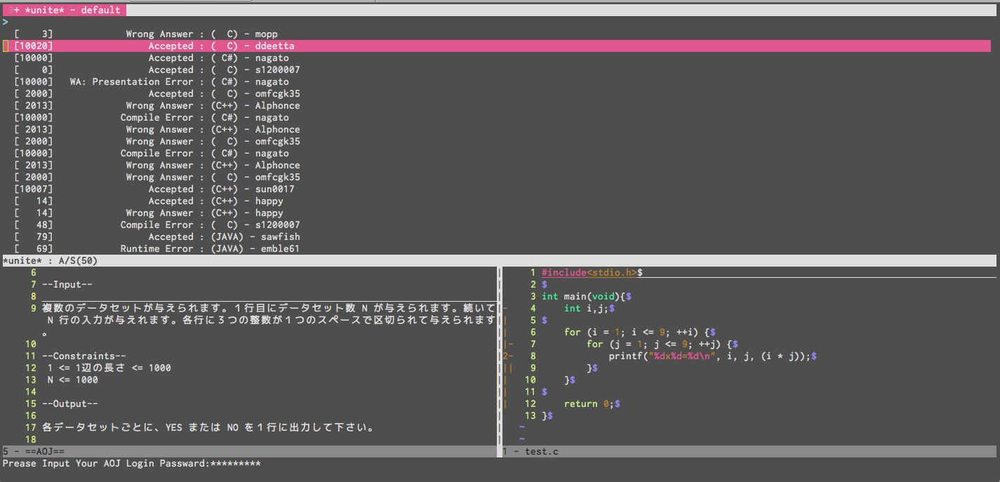

# AOJ.vim
=========

This is Vim Plugin for View and Submit at AOJ.  
Default Interface is Unite.vim.  
This provides Unite-Source(AOJ/ProblemList).

## Require
=========
Unite.vim  
webapi.vim

## Command
=========
**:AOJSubmit**  
    When You open one of problems, It Submits Your source code to AOJ.  
    Then, AOJ.vim will open unite buffer.  
    If You cannot see your ID in it, Please execute redraw command like <C-L> in unite buffer.  

**:AOJViewProblems**  
    It opens Problem List in unite buffer.  

**:AOJViewStaticticsLogs**  
    It opens Submit Statistics List in unite buffer.

## Images
=========

